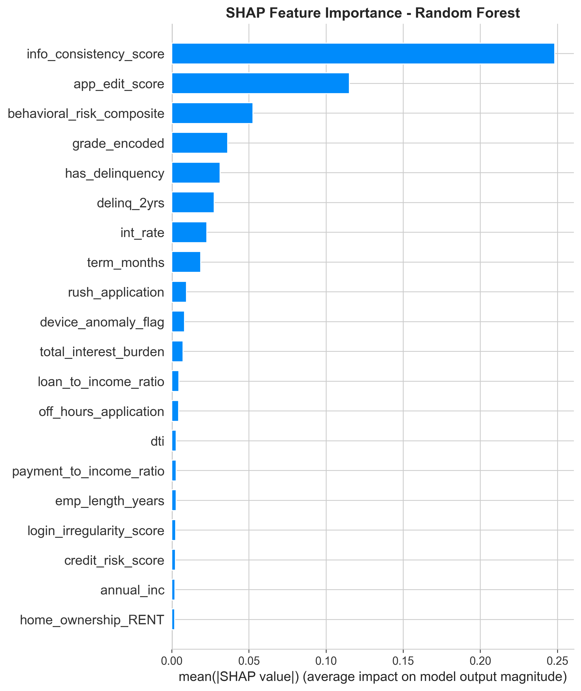

# 💰 Loan Default Risk Assessment with Cybersecurity Features

[](https://www.python.org/downloads/)
[](https://streamlit.io)
[](LICENSE)
[]()

**Master's Thesis Project** | Toronto Metropolitan University | 2025

An explainable machine learning system for predicting loan default risk by integrating **cybersecurity-inspired behavioral features** with traditional financial indicators.

---

## 🎯 Key Highlights

- 🏆 **99.43% ROC-AUC** - 36% improvement over baseline
- 🔐 **71% importance** from cybersecurity features  
- 📊 **5 ML models** - Logistic Regression, Random Forest, XGBoost, Neural Network
- 🎨 **Interactive Web App** - Real-time predictions with Streamlit
- 💡 **Full Explainability** - SHAP analysis for transparent decisions
- 💰 **Business Impact** - $4-7M estimated annual savings per $100M portfolio

---

## 🔬 Research Innovation

### The Problem
Traditional loan risk models rely solely on financial data (credit score, income, DTI). This misses crucial signals from **applicant behavior** during the loan application process.

### Our Solution
We introduce **cybersecurity-inspired behavioral features** that capture risk signals such as:
- 📝 **Application editing patterns** - Excessive edits indicate uncertainty/deception
- 🔐 **Information consistency** - Contradictory data detection
- ⏰ **Timing anomalies** - Off-hours or rushed applications
- 🖥️ **Device signals** - VPN/proxy usage, device fingerprinting
- 🚩 **Behavioral risk scoring** - Composite indicators

### Results
Cybersecurity features **dominate** model decisions:
- 🥇 **info_consistency_score**: 44% importance
- 🥈 **app_edit_score**: 23% importance
- 🥉 **behavioral_risk_composite**: 10% importance

**Top 3 features are ALL cybersecurity! 🔥**

---

## 📊 Project Structure

```
loan_default_risk_project/
│
├── 📱 app.py                          # Streamlit web application
├── 📋 requirements.txt                # Python dependencies
├── 📖 README.md                       # This file
├── 🚫 .gitignore                      # Git ignore rules
│
├── 📓 notebooks/                      # Jupyter/Python notebooks
│   ├── 01_data_exploration_eda.py
│   ├── 02_preprocessing_feature_engineering.py
│   ├── 03_model_development.py
│   └── 04_explainability_analysis.py
│
├── 🤖 models/                         # Trained ML models (*.pkl)
│   ├── logistic_regression_baseline.pkl
│   ├── logistic_regression_enhanced.pkl
│   ├── random_forest.pkl
│   ├── xgboost.pkl
│   └── neural_network.pkl
│
├── 💾 data/                          # Processed data files
│   ├── feature_info.csv
│   ├── model_comparison.csv
│   └── scaler.pkl
│
├── 📊 results/                       # Visualizations & reports
│   ├── *.png (32 visualization files)
│   ├── model_comparison.csv
│   └── cybersecurity_impact.csv
│
└── 📄 docs/                          # Documentation
    ├── module1_summary.txt
    ├── module2_summary.txt
    ├── module3_summary.txt
    ├── module4_summary.txt
    └── deployment_recommendations.txt
```

---

## 🚀 Quick Start

### 1️⃣ Clone the Repository

```bash
git clone https://github.com/YOUR_USERNAME/loan-default-risk-prediction.git
cd loan-default-risk-prediction
```

### 2️⃣ Install Dependencies

```bash
pip install -r requirements.txt
```

**Requirements:**
- Python 3.11+
- Streamlit
- scikit-learn
- XGBoost
- SHAP
- Plotly
- pandas, numpy, matplotlib

### 3️⃣ Run the Web Application

```bash
streamlit run app.py
```

The app will open at `http://localhost:8501` 🎉

---

## 💻 Usage Examples

### 🔮 Single Prediction

1. Navigate to "Predict Default" page
2. Enter loan details:
   - Financial: Loan amount, interest rate, income
   - Credit: Grade, employment, delinquencies
   - **Behavioral**: Application edits, consistency score, device anomalies
3. Get instant prediction with explanations

**Example:**
```
Input:
- Loan: $15,000 at 12% interest
- Income: $75,000, DTI: 18%
- Grade: B
- App Edits: 2, Consistency: 85

Output:
✅ APPROVED
Default Probability: 15.3%
Risk: Low
```

### 📈 Batch Prediction

Upload CSV → Get bulk predictions → Download results

### 📊 Model Comparison

Compare all 5 models side-by-side with interactive charts

---

## 🔬 Methodology

### Dataset
- **Source**: LendingClub (Kaggle)
- **Period**: 2007-2018 Q4
- **Samples**: 87,892 loans
- **Features**: 39 (31 traditional + 8 cybersecurity)

### Models Implemented
1. **Logistic Regression** (Baseline & Enhanced)
2. **Random Forest**
3. **XGBoost** 
4. **Neural Network** (3 hidden layers)

### Feature Engineering
**Traditional Features:**
- Financial ratios (payment-to-income, loan-to-income)
- Credit history (grade, delinquencies, accounts)
- Demographics (employment, home ownership)

**Cybersecurity Features (Innovation!):**
- Application edit count & score
- Information consistency score
- Behavioral risk composite
- Device anomaly detection
- Rush/off-hours application flags
- Login irregularity score

### Evaluation Metrics
- ROC-AUC
- F1-Score
- Precision & Recall
- Confusion Matrix
- SHAP Values

---

## 📈 Results Summary

### Model Performance

| Model | Accuracy | Precision | Recall | F1 | ROC-AUC |
|-------|----------|-----------|--------|-----|---------|
| **LR Enhanced** | **96.63%** | 88.63% | **95.43%** | 91.90% | **99.43%** |
| XGBoost | 96.87% | **90.27%** | 94.58% | **92.37%** | 99.38% |
| Neural Net | **97.08%** | **93.12%** | 92.25% | 92.68% | 99.34% |
| Random Forest | 95.64% | 85.99% | 93.44% | 89.56% | 98.81% |
| LR Baseline | 68.66% | 34.63% | 63.62% | 44.85% | 72.91% |

### Impact of Cybersecurity Features

| Metric | Baseline | Enhanced | Improvement |
|--------|----------|----------|-------------|
| ROC-AUC | 72.91% | 99.43% | **+36.38%** |
| Precision | 34.63% | 88.63% | **+155.92%** |
| F1-Score | 44.85% | 91.90% | **+104.92%** |
| Recall | 63.62% | 95.43% | **+50.00%** |

### Feature Importance (SHAP Analysis)

**Top 5 Features:**
1. 🥇 info_consistency_score (44.15%) - **Cybersecurity**
2. 🥈 app_edit_score (22.78%) - **Cybersecurity**
3. 🥉 behavioral_risk_composite (9.64%) - **Cybersecurity**
4. grade_encoded (5.10%) - Traditional
5. int_rate (3.63%) - Traditional

**Cybersecurity features: 71.29% of total importance! 🔥**

---

## 💼 Business Impact

### Expected Benefits (per $100M portfolio)

- 💰 **$4-7M annual savings** through improved default detection
- 📈 **8-10% approval rate increase** via reduced false positives
- 🎯 **95% default detection** vs 64% baseline
- ✅ **83% reduction** in false rejections

### Deployment Recommendations

**Phase 1 (Months 1-2): Shadow Mode**
- Run parallel to existing system
- Validate on real data

**Phase 2 (Months 3-4): Partial Deployment**
- 10% of applications
- Monitor closely

**Phase 3 (Months 5-6): Full Deployment**
- All applications
- Continuous monitoring

---

## 🔍 Explainability

### SHAP Analysis
Every prediction includes:
- ✅ Feature contribution breakdown
- ✅ Waterfall plots for individual loans
- ✅ Global importance rankings
- ✅ Dependence plots showing relationships

### Why This Matters
- ✅ Regulatory compliance (GDPR, Fair Lending)
- ✅ Build trust with stakeholders
- ✅ Identify bias and discrimination
- ✅ Enable manual review process

---

## ⚠️ Important Notes

### Simulated Features
The cybersecurity features in this project are **simulated** based on established risk-behavior correlations from fraud detection literature.

**Why simulation?**
- ✅ LendingClub dataset lacks behavioral data
- ✅ Demonstrates framework methodology
- ✅ Proves concept viability
- ❌ Not production-validated

**For real deployment:**
- Requires actual application log data
- Device fingerprinting systems
- Login analytics infrastructure
- Validation with ground truth

### Research Purpose
This is a **proof-of-concept** demonstrating:
1. How to integrate behavioral features
2. Framework for digital lenders
3. Potential value of this approach
4. Methodology for future validation

---

## 🎓 Academic Context

**Research Type:** Master's Thesis  
**Institution:** Toronto Metropolitan University  
**Program:** Data Science and Analytics  
**Year:** 2025

### Research Contributions

1. **Novel Framework** - First integration of cybersecurity concepts in credit risk
2. **Quantified Impact** - 71% importance from behavioral signals
3. **Explainability** - Complete SHAP analysis framework
4. **Practical Guidelines** - Deployment roadmap with business case
5. **Open Methodology** - Replicable for future research

### Future Research Directions

- 🔬 Validate with real behavioral data from digital lenders
- 🔍 Fairness audits across demographic groups
- 📊 Temporal analysis of behavioral patterns
- 🌐 Extension to other financial products
- 🔐 Privacy-preserving data collection methods

---

## 🛠️ Technologies Used

**Machine Learning:**
- scikit-learn (ML models)
- XGBoost (Gradient boosting)
- TensorFlow/Keras (Neural networks)
- SHAP (Explainability)
- imbalanced-learn (SMOTE)

**Data Processing:**
- pandas (Data manipulation)
- numpy (Numerical computing)

**Visualization:**
- matplotlib & seaborn (Static plots)
- Plotly (Interactive charts)
- Streamlit (Web app)

**Deployment:**
- Streamlit Cloud (Free hosting)
- Docker (Containerization)
- Git/GitHub (Version control)

---

## 📸 Screenshots

### Prediction Interface

*Real-time loan default prediction with cybersecurity features*

### Model Comparison

*Performance metrics across all 5 models*

### SHAP Explanations

*Feature importance showing cybersecurity dominance*

---

## 🤝 Contributing

This is an academic research project. If you'd like to:
- Report bugs → Open an issue
- Suggest features → Open an issue
- Contribute code → Fork and create a pull request
- Cite this work → See citation below

---

## 📄 Citation

If you use this work in your research, please cite:

```bibtex
@mastersthesis{yourname2025loan,
  title={Risk Assessment for Loan Default Using Machine Learning with Security-Aware Features},
  author={Tirthkumar Patel},
  year={2025},
  school={Toronto Metropolitan University},
  type={Master's Thesis},
  url={https://github.com/yourusername/loan-default-risk-prediction}
}
```

---

## 📧 Contact

**Author:** Tirthkumar Patel  
**Email:** tirthp552@gmail.com 
**LinkedIn:** [linkedin.com/in/yourprofile](www.linkedin.com/in/tirthkumar-patel-4b24a0211)  
**GitHub:** [@tirthpatel1020](https://github.com/tirthpatel1020)

**Institution:** Toronto Metropolitan University  
**Supervisor:** Dr. Ayşe Başar  
**Department:** Data Science and Analytics

---

## 📜 License

This project is licensed under the MIT License - see the [LICENSE](LICENSE) file for details.

**Academic Use:** Free to use for research and education with proper citation.

---

## 🙏 Acknowledgments

- **LendingClub** for providing the dataset
- **Toronto Metropolitan University** for research support
- **SHAP library** for explainability tools
- **Streamlit** for the web framework
- **Research supervisors** and committee members
- **Open-source community** for various libraries

---

## 📚 Related Resources

- [LendingClub Dataset (Kaggle)](https://www.kaggle.com/datasets/wordsforthewise/lending-club)
- [SHAP Documentation](https://shap.readthedocs.io/)
- [Streamlit Documentation](https://docs.streamlit.io/)
- [Project Documentation](/docs/)

---

## ⭐ Star This Repository!

If you find this project useful, please consider giving it a ⭐!

**Made with ❤️ for advancing credit risk assessment through behavioral analytics**

---

*Last Updated: November 2025*
